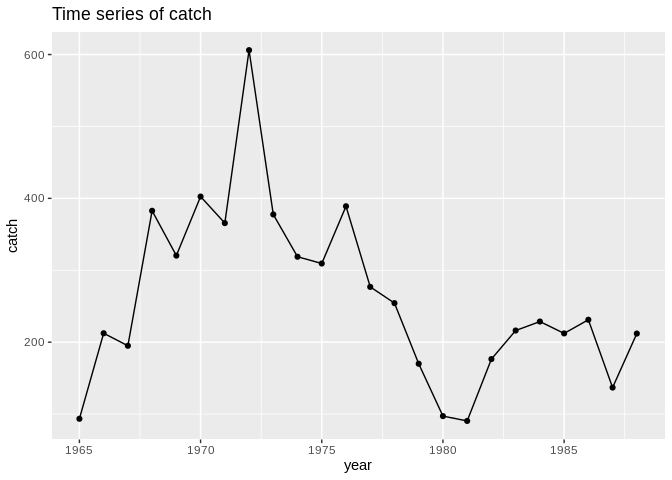
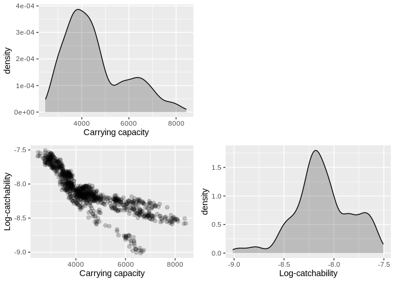
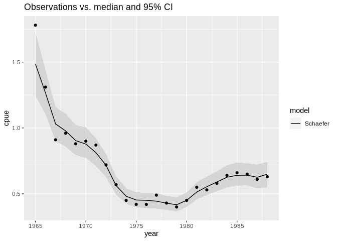
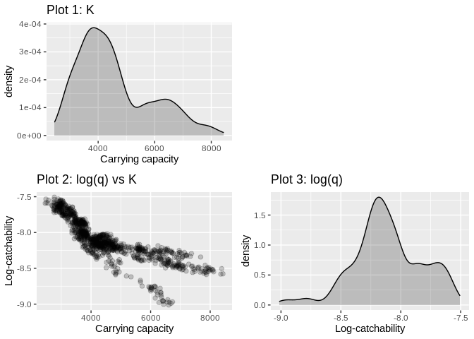

How to bypass the Shiny GUI
===========================

This notebook explains how you can fit surplus production models and get
plots and tables without using the Shiny graphical user interface
provided in package `rcsurplus1d`.

    library(rcsurplus1d)

First, you need to set up an object called `input`, which contains all
the model specifications.

    input <- list(
      mydata = NULL, # or: list(datapath = '/path/to/your/catch/and/effort/file.csv'),
      spm = 'Schaefer', # or: 'Pella-Tomlinson', 'Fox', 'Alternative'
      sprior = myglobal$priors, # size-2 vector with lower and upper bound for log(sigma)
      rprior = myglobal$priorr, # same as above, for r
      PHIprior = myglobal$priorPHI, # same as above, for phi
      Kprior = myglobal$priorK, # same as above, for K
      qprior = myglobal$priorq, # same as above, for q
      MCMCn = myglobal$mcmc_n[1], # desired number of MCMC variates
      MCMCc = myglobal$mcmc_c[1], # number of MCMC chains
      MCMCb = myglobal$mcmc_b[1], # fraction of MCMC iterations discarded for burn-in
      MCMCt = myglobal$mcmc_t[1], # MCMC thinning factor
      overrelax = FALSE, # or TRUE, if over-relaxed sampling is desired (slower but better mixed)
      do_coda = TRUE # or FALSE, if you do not wish to see CODA output (faster)
    )

Then, create a `rcsurplus1d` object and call its method `fit_models`:

    a <- rcsurplus1d()
    a$fit_models(input = input)

    ## Abstracting K ... 1001 valid values
    ## Abstracting lq ... 1001 valid values
    ## Abstracting lsigma ... 1001 valid values
    ## Abstracting r ... 1001 valid values

To plot the data, create this auxiliary function:

    plot_data <- function(rcsurplus1d_obj, column_name, input) {
      valid_column_names <- c('catch', 'effort', 'cpue')
      input_names <- c('do_catch', 'do_effort', 'do_cpue')
      for (nm in input_names) input[nm] <- FALSE
      input$one_row <- TRUE
      if (!(column_name %in% valid_column_names)) {
        print0(c('Invalid column name; valid names: ', valid_column_names))
        return()
      }
      input[input_names[which(column_name == valid_column_names)]] <- TRUE
      rcsurplus1d_obj$plot_data(input)
    }

Then, you can produce a plot of your data with:

    plot_data(a, 'catch', input)

To plot one or more model parameters, create this auxiliary function:

    plot_hyperparameters <- function(rcsurplus1d_obj, parameter_names, input) {
      valid_parameter_names <- c('K', 'r', 'phi', 'q', 'sigma', 'msy', 'bmsy', 'fmsy')
      input_names <- c(
        'plot_KeRHO', 'plot_r', 'plot_PHI', 'plot_qCHI', 'plot_lSIGMA',
        'plot_msy', 'plot_bmsy', 'plot_fmsy'
        )
      input$spm_hyper <- input$spm
      input$one_row <- TRUE
      for (nm in input_names) input[nm] <- FALSE
      for (param in parameter_names) {
        if (!(param %in% valid_parameter_names)) {
          print0('Invalid parameter name; valid names: ', valid_parameter_names)
          return()
        }
        input[input_names[which(param == valid_parameter_names)]] <- TRUE
      }
      rcsurplus1d_obj$plot_hyperparameters(input)
    }

After you have fitted a model, you can call this function with, for
example:

    plot_hyperparameters(a, c('K', 'q'), input)

To plot observed and fitted time-series of CPUE, use the function

    plot_fitted_cpue <- function(rcsurplus1d_obj, input) {
      input$spm_fit <- input$spm
      rcsurplus1d_obj$plot_fitted_cpue(input)
    }

With this function, you can do

    plot_fitted_cpue(a, input)

Finally, to retrieve CODA output (in case `input$CODA` is TRUE), you can
do

    a$coda_models

    ## [[1]]
    ## NULL
    ## 
    ## [[2]]
    ## [[1]]
    ## Markov Chain Monte Carlo (MCMC) output:
    ## Start = 53 
    ## End = 1053 
    ## Thinning interval = 1 
    ##         K     lq lsigma       r
    ## 53   6283 -8.977 -3.775 0.18940
    ## 54   6155 -8.916 -3.946 0.29190
    ## 55   6402 -8.951 -3.943 0.12100
    ## 56   6438 -9.004 -3.935 0.22740
    ## 57   6684 -8.989 -3.887 0.09979
    ## 58   6735 -8.969 -3.822 0.30020
    ## 59   6626 -8.976 -4.062 0.23490
    ## 60   6610 -9.012 -3.859 0.17100
    ## 61   6421 -8.954 -4.117 0.20020
    ## 62   6420 -8.962 -3.904 0.23620
    ## 63   6554 -8.972 -4.129 0.18400
    ## 64   6577 -8.939 -4.141 0.23770
    ## 65   6353 -8.874 -4.131 0.18490
    ## 66   6223 -8.833 -4.328 0.24180
    ## 67   6167 -8.812 -4.566 0.14650
    ## 68   6023 -8.761 -4.083 0.12020
    ## 69   6138 -8.749 -4.549 0.22190
    ## 70   6322 -8.780 -4.269 0.04099
    ## 71   6165 -8.761 -4.267 0.05447
    ## 72   5971 -8.770 -3.954 0.31400
    ## 73   5717 -8.749 -4.254 0.07011
    ## 74   5938 -8.757 -4.336 0.13630
    ## 75   5999 -8.791 -4.049 0.14110
    ## 76   6340 -8.835 -3.985 0.29960
    ## 77   6346 -8.842 -3.965 0.40820
    ## 78   6364 -8.907 -3.458 0.22780
    ## 79   6230 -8.871 -4.052 0.29510
    ## 80   6026 -8.792 -4.260 0.17530
    ## 81   6001 -8.816 -4.252 0.21820
    ## 82   6038 -8.778 -3.873 0.18530
    ## 83   6122 -8.756 -4.123 0.24050
    ## 84   6021 -8.765 -4.233 0.27160
    ## 85   5661 -8.692 -4.840 0.20260
    ## 86   5657 -8.667 -4.406 0.18300
    ## 87   5342 -8.619 -3.958 0.27110
    ## 88   5190 -8.607 -3.888 0.18420
    ## 89   4832 -8.535 -3.806 0.19840
    ## 90   4894 -8.505 -4.275 0.19390
    ## 91   4945 -8.551 -4.256 0.17070
    ## 92   4768 -8.555 -3.790 0.16290
    ## 93   4827 -8.591 -3.555 0.37400
    ## 94   4823 -8.578 -4.242 0.40180
    ## 95   4854 -8.556 -3.931 0.33740
    ## 96   4513 -8.491 -3.945 0.19090
    ## 97   4762 -8.477 -4.924 0.30180
    ## 98   4690 -8.472 -4.632 0.28220
    ## 99   4798 -8.463 -4.743 0.10480
    ## 100  4690 -8.442 -4.432 0.22260
    ## 101  4673 -8.431 -4.337 0.27200
    ## 102  4520 -8.417 -4.463 0.26900
    ## 103  4597 -8.398 -4.355 0.27400
    ## 104  4719 -8.398 -4.438 0.30120
    ## 105  4905 -8.404 -4.433 0.19550
    ## 106  4993 -8.424 -4.409 0.25770
    ## 107  4951 -8.417 -4.978 0.20500
    ## 108  4951 -8.379 -4.801 0.15890
    ## 109  4644 -8.358 -4.675 0.16030
    ## 110  4574 -8.311 -4.768 0.15300
    ## 111  4607 -8.329 -4.868 0.19130
    ## 112  4430 -8.281 -4.828 0.25250
    ## 113  4440 -8.270 -4.689 0.23970
    ## 114  4523 -8.242 -4.193 0.23460
    ## 115  4568 -8.280 -4.100 0.22910
    ## 116  4415 -8.286 -4.376 0.23650
    ## 117  4207 -8.220 -4.384 0.26870
    ## 118  4179 -8.164 -5.013 0.24040
    ## 119  4118 -8.127 -5.128 0.24970
    ## 120  4053 -8.097 -4.897 0.27870
    ## 121  4039 -8.105 -4.922 0.22170
    ## 122  4054 -8.074 -4.849 0.22490
    ## 123  4053 -8.067 -4.868 0.20940
    ## 124  4113 -8.088 -4.543 0.27970
    ## 125  3985 -8.095 -4.450 0.21500
    ## 126  4004 -8.135 -4.728 0.33550
    ## 127  4169 -8.160 -4.603 0.22420
    ## 128  4165 -8.143 -4.910 0.26980
    ## 129  4189 -8.178 -4.672 0.21300
    ## 130  4212 -8.191 -4.973 0.22750
    ## 131  4213 -8.145 -5.251 0.20950
    ## 132  4195 -8.126 -5.008 0.25650
    ## 133  4170 -8.142 -5.075 0.20640
    ## 134  4165 -8.133 -5.044 0.22560
    ## 135  4311 -8.171 -4.762 0.17700
    ## 136  4329 -8.146 -5.047 0.23890
    ## 137  4405 -8.170 -5.084 0.18880
    ## 138  4404 -8.181 -5.250 0.22220
    ## 139  4753 -8.219 -5.266 0.20850
    ## 140  4870 -8.255 -4.412 0.21590
    ## 141  4683 -8.193 -4.701 0.27660
    ## 142  4719 -8.177 -4.381 0.19890
    ## 143  4670 -8.154 -4.383 0.19790
    ## 144  4577 -8.167 -4.886 0.22540
    ## 145  4429 -8.175 -4.675 0.29340
    ## 146  4470 -8.179 -4.925 0.18740
    ## 147  4638 -8.173 -4.924 0.25970
    ## 148  4489 -8.175 -4.529 0.17490
    ## 149  4586 -8.198 -4.110 0.18620
    ## 150  4316 -8.209 -4.465 0.22330
    ## 151  4272 -8.189 -4.313 0.28190
    ## 152  4294 -8.171 -4.159 0.26170
    ## 153  4259 -8.153 -4.590 0.34640
    ## 154  4187 -8.143 -4.474 0.33660
    ## 155  4085 -8.116 -4.483 0.34160
    ## 156  4074 -8.102 -4.627 0.21880
    ## 157  4230 -8.145 -5.010 0.28390
    ## 158  4200 -8.114 -4.960 0.24730
    ## 159  4301 -8.147 -4.784 0.24220
    ## 160  4427 -8.152 -5.012 0.20490
    ## 161  4550 -8.173 -4.590 0.23820
    ## 162  4622 -8.217 -4.606 0.26560
    ## 163  4712 -8.239 -4.611 0.20870
    ## 164  4755 -8.248 -4.596 0.23560
    ## 165  4789 -8.225 -4.708 0.28320
    ## 166  4866 -8.226 -4.683 0.22280
    ## 167  4718 -8.225 -4.623 0.21160
    ## 168  4639 -8.180 -4.704 0.20650
    ## 169  4631 -8.160 -4.704 0.21160
    ## 170  4560 -8.154 -4.858 0.23810
    ## 171  4439 -8.137 -5.176 0.24550
    ## 172  4371 -8.132 -4.546 0.25590
    ## 173  4466 -8.128 -5.528 0.23530
    ## 174  4436 -8.149 -4.549 0.20970
    ## 175  4471 -8.138 -4.918 0.26490
    ## 176  4473 -8.140 -5.264 0.29140
    ## 177  4418 -8.150 -5.040 0.28210
    ## 178  4288 -8.159 -4.442 0.19410
    ## 179  4438 -8.113 -5.055 0.22760
    ## 180  4421 -8.141 -4.999 0.26800
    ## 181  4538 -8.150 -4.728 0.26110
    ## 182  4451 -8.151 -4.746 0.29070
    ## 183  4718 -8.140 -4.445 0.20620
    ## 184  4781 -8.196 -4.701 0.20500
    ## 185  4666 -8.203 -4.541 0.20080
    ## 186  4743 -8.186 -4.680 0.21930
    ## 187  4760 -8.203 -5.012 0.21860
    ## 188  4521 -8.152 -4.809 0.23290
    ## 189  4623 -8.145 -4.997 0.24580
    ## 190  4626 -8.128 -5.043 0.22020
    ## 191  4602 -8.119 -5.283 0.22930
    ## 192  4597 -8.143 -5.165 0.21980
    ## 193  4588 -8.118 -5.288 0.23860
    ## 194  4526 -8.130 -4.835 0.22870
    ## 195  4679 -8.138 -4.728 0.21740
    ## 196  4742 -8.167 -4.863 0.26750
    ## 197  4918 -8.179 -4.856 0.29200
    ## 198  4731 -8.187 -4.919 0.17150
    ## 199  4661 -8.149 -4.713 0.19490
    ## 200  4714 -8.168 -4.409 0.24910
    ## 201  4519 -8.136 -4.436 0.22390
    ## 202  4544 -8.115 -3.954 0.22570
    ## 203  4809 -8.162 -3.991 0.21010
    ## 204  4793 -8.207 -4.809 0.27110
    ## 205  4879 -8.197 -5.175 0.25310
    ## 206  4906 -8.200 -5.032 0.26200
    ## 207  4968 -8.215 -4.616 0.16050
    ## 208  4878 -8.209 -4.743 0.15620
    ## 209  4820 -8.232 -4.671 0.18110
    ## 210  4873 -8.189 -4.777 0.18100
    ## 211  4911 -8.203 -4.959 0.23780
    ## 212  4915 -8.232 -4.856 0.21030
    ## 213  4853 -8.211 -5.243 0.23410
    ## 214  4716 -8.169 -5.021 0.26520
    ## 215  4717 -8.177 -4.208 0.18240
    ## 216  4811 -8.177 -4.649 0.25740
    ## 217  4811 -8.153 -4.797 0.28230
    ## 218  4791 -8.122 -5.148 0.28820
    ## 219  4741 -8.114 -5.032 0.29260
    ## 220  4632 -8.080 -5.037 0.25120
    ## 221  4613 -8.066 -4.554 0.28660
    ## 222  4677 -8.062 -4.489 0.28800
    ## 223  4663 -8.027 -4.682 0.29800
    ## 224  4560 -8.071 -4.521 0.25780
    ## 225  4828 -8.106 -4.879 0.21700
    ## 226  4714 -8.115 -5.207 0.21640
    ## 227  4825 -8.118 -4.787 0.20520
    ## 228  4998 -8.154 -4.843 0.21190
    ## 229  5013 -8.175 -4.869 0.16650
    ## 230  5004 -8.208 -4.796 0.23970
    ## 231  4999 -8.223 -4.844 0.26810
    ## 232  5045 -8.213 -4.943 0.17100
    ## 233  4965 -8.232 -4.917 0.17980
    ## 234  4798 -8.207 -4.875 0.22710
    ## 235  4770 -8.206 -4.927 0.24940
    ## 236  4653 -8.173 -4.464 0.25490
    ## 237  4505 -8.215 -4.361 0.21730
    ## 238  4253 -8.180 -4.482 0.27840
    ## 239  4239 -8.164 -4.109 0.26750
    ## 240  4151 -8.094 -4.058 0.31690
    ## 241  4228 -8.080 -3.889 0.33110
    ## 242  4273 -8.089 -3.969 0.33050
    ## 243  4177 -8.079 -4.632 0.30370
    ## 244  4276 -8.068 -4.661 0.21380
    ## 245  4282 -8.079 -4.940 0.22950
    ## 246  4432 -8.066 -4.939 0.17920
    ## 247  4403 -8.100 -5.097 0.21820
    ## 248  4467 -8.119 -5.186 0.27210
    ## 249  4443 -8.089 -5.125 0.22490
    ## 250  4392 -8.081 -5.158 0.23580
    ## 251  4319 -8.074 -5.012 0.22980
    ## 252  4403 -8.040 -5.005 0.26120
    ## 253  4099 -8.029 -4.824 0.24930
    ## 254  4380 -8.028 -4.274 0.25380
    ## 255  4348 -8.070 -4.799 0.15720
    ## 256  4370 -8.044 -4.771 0.23020
    ## 257  4328 -8.040 -5.202 0.24370
    ## 258  4537 -8.040 -5.071 0.28440
    ## 259  4516 -8.053 -4.903 0.25800
    ## 260  4417 -8.039 -5.447 0.19950
    ## 261  4516 -8.056 -4.858 0.19430
    ## 262  4521 -8.046 -4.921 0.26390
    ## 263  4415 -8.027 -4.797 0.23600
    ## 264  4446 -8.030 -4.863 0.23270
    ## 265  4373 -8.033 -5.282 0.23140
    ## 266  4401 -8.024 -5.216 0.23100
    ## 267  4539 -8.016 -5.112 0.23920
    ## 268  4490 -8.029 -4.284 0.15990
    ## 269  4844 -8.098 -4.807 0.19600
    ## 270  5093 -8.162 -4.945 0.18190
    ## 271  5186 -8.204 -4.784 0.16010
    ## 272  5021 -8.185 -4.924 0.26230
    ## 273  5129 -8.196 -4.799 0.25050
    ## 274  5641 -8.226 -4.970 0.20610
    ## 275  5593 -8.223 -4.914 0.17380
    ## 276  5649 -8.241 -4.870 0.16810
    ## 277  5836 -8.266 -4.936 0.17880
    ## 278  5821 -8.262 -5.064 0.17140
    ## 279  5570 -8.230 -4.882 0.19960
    ## 280  5524 -8.218 -4.957 0.18960
    ## 281  5505 -8.216 -4.603 0.20700
    ## 282  5571 -8.185 -4.618 0.19910
    ## 283  5568 -8.168 -4.265 0.15840
    ## 284  5622 -8.212 -4.023 0.19110
    ## 285  5673 -8.242 -4.886 0.18830
    ## 286  5593 -8.242 -4.898 0.26230
    ## 287  5570 -8.242 -4.344 0.17010
    ## 288  5636 -8.249 -4.369 0.22530
    ## 289  6045 -8.297 -4.594 0.18140
    ## 290  6061 -8.328 -4.837 0.12640
    ## 291  6349 -8.372 -4.506 0.19380
    ## 292  6222 -8.346 -4.469 0.15720
    ## 293  6333 -8.369 -4.469 0.12470
    ## 294  6336 -8.380 -4.253 0.13970
    ## 295  6659 -8.403 -4.208 0.12170
    ## 296  6793 -8.438 -4.618 0.11690
    ## 297  6846 -8.492 -4.723 0.15740
    ## 298  6579 -8.457 -4.775 0.14100
    ## 299  6379 -8.398 -4.551 0.09163
    ## 300  6578 -8.395 -4.853 0.04577
    ## 301  6947 -8.446 -4.966 0.17810
    ## 302  7089 -8.490 -4.298 0.17700
    ## 303  7159 -8.481 -4.323 0.17360
    ## 304  7086 -8.466 -5.300 0.16790
    ## 305  7099 -8.464 -4.753 0.16970
    ## 306  6733 -8.470 -4.784 0.16400
    ## 307  6681 -8.399 -4.550 0.11460
    ## 308  6557 -8.363 -4.655 0.20610
    ## 309  6604 -8.379 -4.697 0.20150
    ## 310  7280 -8.442 -4.558 0.15010
    ## 311  7577 -8.488 -4.279 0.14900
    ## 312  7596 -8.506 -4.648 0.11760
    ## 313  7427 -8.501 -4.709 0.10750
    ## 314  7406 -8.469 -4.525 0.12580
    ## 315  7614 -8.482 -4.635 0.14540
    ## 316  8041 -8.510 -4.797 0.15440
    ## 317  8117 -8.548 -4.559 0.14140
    ## 318  7945 -8.508 -4.675 0.12690
    ## 319  7877 -8.501 -4.724 0.14840
    ## 320  7834 -8.458 -4.700 0.03995
    ## 321  7955 -8.486 -4.635 0.18780
    ## 322  7987 -8.517 -4.764 0.18800
    ## 323  7907 -8.494 -4.484 0.14050
    ## 324  8384 -8.505 -4.472 0.12990
    ## 325  8429 -8.577 -4.311 0.15730
    ## 326  8356 -8.581 -4.454 0.07890
    ## 327  8091 -8.518 -4.272 0.08545
    ## 328  7996 -8.530 -4.333 0.06243
    ## 329  8087 -8.525 -4.251 0.11950
    ## 330  7850 -8.520 -4.137 0.21060
    ## 331  7062 -8.470 -4.256 0.19330
    ## 332  6920 -8.459 -4.449 0.20560
    ## 333  6782 -8.452 -4.583 0.17700
    ## 334  6949 -8.466 -4.608 0.10170
    ## 335  6911 -8.483 -4.525 0.17550
    ## 336  6878 -8.477 -4.921 0.13770
    ## 337  6886 -8.459 -4.553 0.16320
    ## 338  6779 -8.466 -4.698 0.18230
    ## 339  6631 -8.440 -4.696 0.11990
    ## 340  6454 -8.385 -4.576 0.25190
    ## 341  6613 -8.417 -4.648 0.13510
    ## 342  6587 -8.403 -4.810 0.14910
    ## 343  6599 -8.379 -4.681 0.19440
    ## 344  6190 -8.353 -4.835 0.13360
    ## 345  6191 -8.288 -4.845 0.18160
    ## 346  6047 -8.285 -4.631 0.21400
    ## 347  6015 -8.258 -4.695 0.16510
    ## 348  6088 -8.289 -4.423 0.17960
    ## 349  6040 -8.271 -4.517 0.22720
    ## 350  6302 -8.297 -4.501 0.11270
    ## 351  6374 -8.294 -4.581 0.15290
    ## 352  6439 -8.269 -4.473 0.15960
    ## 353  6527 -8.293 -4.663 0.20360
    ## 354  6308 -8.269 -4.721 0.19380
    ## 355  6162 -8.248 -4.850 0.15090
    ## 356  6332 -8.245 -4.578 0.12240
    ## 357  6345 -8.275 -4.587 0.14610
    ## 358  6580 -8.248 -4.436 0.22200
    ## 359  6534 -8.254 -4.719 0.19940
    ## 360  6374 -8.211 -4.119 0.12660
    ## 361  6247 -8.184 -4.626 0.13530
    ## 362  6338 -8.248 -5.058 0.17860
    ## 363  6710 -8.279 -4.753 0.13090
    ## 364  6754 -8.288 -4.205 0.18980
    ## 365  6495 -8.226 -4.487 0.19730
    ## 366  6713 -8.261 -4.440 0.15780
    ## 367  6537 -8.272 -4.393 0.22710
    ## 368  6661 -8.259 -4.822 0.10880
    ## 369  6689 -8.276 -4.484 0.16960
    ## 370  6530 -8.239 -4.496 0.16010
    ## 371  6500 -8.243 -4.393 0.18090
    ## 372  6568 -8.225 -4.388 0.21830
    ## 373  6959 -8.250 -4.135 0.12780
    ## 374  7372 -8.293 -4.273 0.13640
    ## 375  7329 -8.334 -4.344 0.12570
    ## 376  7679 -8.342 -4.358 0.15170
    ## 377  7200 -8.316 -4.272 0.11620
    ## 378  7163 -8.316 -4.283 0.16910
    ## 379  6957 -8.311 -4.568 0.12920
    ## 380  6983 -8.276 -4.722 0.15760
    ## 381  6965 -8.280 -4.788 0.14190
    ## 382  7040 -8.286 -4.646 0.14040
    ## 383  6898 -8.298 -4.544 0.13350
    ## 384  7219 -8.315 -4.730 0.18120
    ## 385  6725 -8.290 -4.325 0.20480
    ## 386  7133 -8.278 -4.487 0.11190
    ## 387  7069 -8.341 -4.821 0.13210
    ## 388  7075 -8.339 -4.248 0.14010
    ## 389  7205 -8.329 -4.533 0.14150
    ## 390  7050 -8.359 -4.455 0.14110
    ## 391  6877 -8.344 -4.799 0.13580
    ## 392  6805 -8.346 -4.844 0.17330
    ## 393  6923 -8.363 -5.073 0.13410
    ## 394  6952 -8.397 -4.985 0.14640
    ## 395  6955 -8.427 -4.961 0.09827
    ## 396  6937 -8.426 -4.829 0.12200
    ## 397  7027 -8.451 -4.834 0.15030
    ## 398  6888 -8.460 -4.590 0.15850
    ## 399  7378 -8.473 -4.905 0.14910
    ## 400  7467 -8.517 -4.893 0.14240
    ## 401  7662 -8.553 -4.940 0.13310
    ## 402  7479 -8.544 -4.982 0.12330
    ## 403  7863 -8.560 -5.103 0.11760
    ## 404  7712 -8.539 -4.958 0.10980
    ## 405  7716 -8.506 -4.728 0.15550
    ## 406  7937 -8.545 -4.158 0.07024
    ## 407  7791 -8.570 -4.442 0.06358
    ## 408  7803 -8.546 -4.219 0.19680
    ## 409  7874 -8.587 -4.178 0.19480
    ## 410  7855 -8.552 -4.732 0.11350
    ## 411  7412 -8.557 -4.978 0.11220
    ## 412  7194 -8.539 -4.992 0.17010
    ## 413  7057 -8.522 -4.914 0.14190
    ## 414  6980 -8.509 -4.834 0.18890
    ## 415  6366 -8.453 -4.610 0.18900
    ## 416  6478 -8.425 -4.413 0.17680
    ## 417  6434 -8.427 -4.353 0.13960
    ## 418  6573 -8.458 -4.655 0.14690
    ## 419  6513 -8.431 -5.086 0.16010
    ## 420  6746 -8.489 -5.076 0.15790
    ## 421  7093 -8.515 -5.117 0.10610
    ## 422  6980 -8.501 -4.894 0.10210
    ## 423  6913 -8.473 -5.148 0.10910
    ## 424  6737 -8.473 -4.861 0.12090
    ## 425  6454 -8.435 -4.990 0.13940
    ## 426  6563 -8.436 -4.635 0.19290
    ## 427  6599 -8.420 -4.751 0.14640
    ## 428  6531 -8.447 -4.753 0.18320
    ## 429  6501 -8.494 -4.218 0.15890
    ## 430  6155 -8.433 -4.464 0.16210
    ## 431  5758 -8.377 -4.636 0.17730
    ## 432  5615 -8.354 -4.607 0.21790
    ## 433  5425 -8.327 -4.724 0.18640
    ## 434  5177 -8.303 -4.741 0.16270
    ## 435  4892 -8.271 -4.611 0.13350
    ## 436  5030 -8.273 -4.532 0.22660
    ## 437  5035 -8.271 -4.620 0.18080
    ## 438  5015 -8.225 -4.168 0.27440
    ## 439  4662 -8.142 -4.708 0.20040
    ## 440  4586 -8.125 -4.525 0.28290
    ## 441  4659 -8.121 -4.653 0.29640
    ## 442  4524 -8.145 -4.598 0.23380
    ## 443  4531 -8.152 -4.575 0.30200
    ## 444  4493 -8.186 -5.218 0.25980
    ## 445  4591 -8.175 -5.023 0.18060
    ## 446  4366 -8.181 -4.876 0.32370
    ## 447  4221 -8.141 -4.581 0.14270
    ## 448  4363 -8.147 -4.672 0.30270
    ## 449  4222 -8.135 -5.159 0.21220
    ## 450  4203 -8.111 -5.385 0.25210
    ## 451  4021 -8.099 -5.153 0.25050
    ## 452  3983 -8.087 -5.132 0.25070
    ## 453  4085 -8.097 -4.937 0.26900
    ## 454  4119 -8.121 -4.937 0.27420
    ## 455  4086 -8.091 -4.888 0.32100
    ## 456  4144 -8.134 -4.915 0.32220
    ## 457  4101 -8.109 -4.675 0.23360
    ## 458  4372 -8.154 -4.571 0.24810
    ## 459  4589 -8.192 -4.678 0.19380
    ## 460  4716 -8.251 -5.054 0.19880
    ## 461  4660 -8.227 -5.194 0.19790
    ## 462  4611 -8.241 -5.259 0.25270
    ## 463  4589 -8.260 -4.952 0.20930
    ## 464  4470 -8.239 -4.364 0.27670
    ## 465  4317 -8.239 -4.488 0.27470
    ## 466  4278 -8.166 -4.454 0.25830
    ## 467  4243 -8.140 -4.849 0.24210
    ## 468  4305 -8.168 -4.402 0.16480
    ## 469  4314 -8.157 -4.738 0.19540
    ## 470  4373 -8.194 -4.637 0.21630
    ## 471  4421 -8.205 -4.606 0.24400
    ## 472  4374 -8.211 -4.664 0.23330
    ## 473  4338 -8.189 -4.973 0.26430
    ## 474  4344 -8.213 -4.966 0.27270
    ## 475  4714 -8.244 -4.493 0.18910
    ## 476  4762 -8.246 -5.238 0.21230
    ## 477  4769 -8.233 -4.982 0.18280
    ## 478  4985 -8.233 -4.983 0.18560
    ## 479  5163 -8.257 -4.678 0.16990
    ## 480  5105 -8.289 -4.970 0.27290
    ## 481  5124 -8.286 -4.858 0.18270
    ## 482  5459 -8.353 -4.801 0.20070
    ## 483  5793 -8.387 -4.722 0.18270
    ## 484  5670 -8.390 -4.703 0.21440
    ## 485  5574 -8.354 -4.700 0.20910
    ## 486  5435 -8.332 -4.985 0.21810
    ## 487  5462 -8.354 -4.775 0.19560
    ## 488  5538 -8.356 -4.974 0.18210
    ## 489  5598 -8.368 -5.142 0.20800
    ## 490  5696 -8.397 -4.675 0.19760
    ## 491  5596 -8.383 -4.507 0.14270
    ## 492  5698 -8.385 -4.584 0.10350
    ## 493  5948 -8.387 -4.680 0.15890
    ## 494  6177 -8.391 -4.665 0.17610
    ## 495  6030 -8.361 -4.798 0.15300
    ## 496  6055 -8.383 -4.335 0.21660
    ## 497  5969 -8.356 -4.712 0.15640
    ## 498  5888 -8.303 -4.721 0.18310
    ## 499  5936 -8.311 -4.661 0.13630
    ## 500  5598 -8.260 -4.675 0.14210
    ## 501  5389 -8.236 -4.619 0.17060
    ## 502  5255 -8.217 -4.474 0.22830
    ## 503  5248 -8.193 -4.631 0.23650
    ## 504  5320 -8.209 -4.155 0.17720
    ## 505  5374 -8.204 -4.998 0.18970
    ## 506  5578 -8.214 -4.298 0.11300
    ## 507  5713 -8.303 -4.648 0.13420
    ## 508  5562 -8.335 -4.657 0.21590
    ## 509  5583 -8.304 -4.180 0.18750
    ## 510  5499 -8.264 -4.289 0.18980
    ## 511  5554 -8.306 -4.505 0.16730
    ## 512  5822 -8.264 -4.500 0.20830
    ## 513  6308 -8.337 -5.042 0.19690
    ## 514  6309 -8.358 -4.635 0.12740
    ## 515  6266 -8.368 -4.441 0.15340
    ## 516  6455 -8.345 -4.826 0.15510
    ## 517  6408 -8.319 -4.687 0.15390
    ## 518  6132 -8.245 -4.922 0.15580
    ## 519  6283 -8.268 -4.924 0.14680
    ## 520  6119 -8.241 -4.745 0.22960
    ## 521  6139 -8.269 -5.176 0.24310
    ## 522  6213 -8.267 -5.163 0.21680
    ## 523  6273 -8.256 -4.554 0.18140
    ## 524  5828 -8.231 -4.505 0.18070
    ## 525  5915 -8.200 -4.967 0.20730
    ## 526  5627 -8.201 -4.753 0.15430
    ## 527  5625 -8.167 -4.597 0.20610
    ## 528  5719 -8.214 -4.450 0.22370
    ## 529  5715 -8.228 -4.372 0.24670
    ## 530  5654 -8.233 -4.620 0.16530
    ## 531  5736 -8.241 -4.601 0.18560
    ## 532  5680 -8.212 -4.795 0.19800
    ## 533  5830 -8.226 -4.969 0.18130
    ## 534  5720 -8.225 -4.718 0.18650
    ## 535  5626 -8.243 -5.116 0.16370
    ## 536  5552 -8.223 -4.833 0.18750
    ## 537  5561 -8.231 -4.871 0.13950
    ## 538  5632 -8.236 -4.574 0.22720
    ## 539  5757 -8.252 -4.563 0.20320
    ## 540  5779 -8.257 -4.176 0.18160
    ## 541  5896 -8.303 -4.221 0.21240
    ## 542  5940 -8.350 -4.649 0.17300
    ## 543  5996 -8.304 -4.740 0.18040
    ## 544  6029 -8.332 -4.490 0.15680
    ## 545  5795 -8.301 -4.412 0.13730
    ## 546  5645 -8.283 -4.400 0.15080
    ## 547  5727 -8.264 -4.518 0.18300
    ## 548  5296 -8.253 -4.259 0.19260
    ## 549  5374 -8.284 -4.662 0.16850
    ## 550  5112 -8.222 -4.615 0.25390
    ## 551  4883 -8.202 -4.823 0.32360
    ## 552  4746 -8.163 -4.896 0.23900
    ## 553  4564 -8.104 -5.154 0.21820
    ## 554  4592 -8.078 -5.129 0.26560
    ## 555  4501 -8.089 -5.074 0.26430
    ## 556  4271 -8.048 -5.202 0.24420
    ## 557  4193 -8.026 -5.163 0.25800
    ## 558  4157 -8.064 -5.342 0.24450
    ## 559  4241 -8.075 -5.151 0.22660
    ## 560  4166 -8.060 -4.887 0.21720
    ## 561  4308 -8.103 -5.134 0.29200
    ## 562  4235 -8.079 -4.988 0.25370
    ## 563  4257 -8.063 -5.131 0.29040
    ## 564  4218 -8.073 -5.299 0.27970
    ## 565  4292 -8.058 -5.307 0.26290
    ## 566  4283 -8.063 -5.042 0.18650
    ## 567  4204 -8.049 -5.055 0.21080
    ## 568  4319 -8.031 -4.849 0.32030
    ## 569  4326 -8.057 -4.826 0.31690
    ## 570  4493 -8.084 -4.902 0.31890
    ## 571  4274 -8.058 -4.814 0.30040
    ## 572  4391 -8.097 -4.760 0.17920
    ## 573  4341 -8.089 -4.662 0.25310
    ## 574  4296 -8.043 -4.720 0.25230
    ## 575  4128 -8.052 -4.873 0.27880
    ## 576  4107 -8.061 -4.496 0.25780
    ## 577  4147 -8.098 -4.936 0.23180
    ## 578  4177 -8.109 -4.806 0.23400
    ## 579  3995 -8.091 -4.500 0.23390
    ## 580  3834 -8.038 -4.850 0.28830
    ## 581  3802 -7.984 -4.730 0.25090
    ## 582  3777 -8.002 -4.993 0.31840
    ## 583  3754 -8.046 -4.841 0.24220
    ## 584  3702 -7.992 -5.178 0.24650
    ## 585  3676 -7.975 -4.998 0.27100
    ## 586  3829 -7.976 -4.921 0.26840
    ## 587  3764 -7.977 -5.104 0.28500
    ## 588  3797 -8.004 -4.869 0.28070
    ## 589  3486 -7.967 -4.327 0.30140
    ## 590  3616 -7.995 -4.444 0.40170
    ## 591  3756 -7.978 -4.163 0.27120
    ## 592  3788 -8.017 -4.559 0.30020
    ## 593  3806 -8.030 -4.479 0.25420
    ## 594  3682 -8.014 -4.540 0.25420
    ## 595  3652 -7.980 -5.164 0.36270
    ## 596  3702 -7.986 -5.162 0.21530
    ## 597  3712 -7.985 -5.279 0.30710
    ## 598  3680 -7.966 -5.069 0.27930
    ## 599  3667 -7.956 -5.114 0.32090
    ## 600  3700 -7.943 -5.084 0.31610
    ## 601  3621 -7.955 -4.873 0.25140
    ## 602  3599 -7.943 -4.684 0.30270
    ## 603  3574 -7.924 -4.717 0.22700
    ## 604  3638 -7.899 -4.376 0.33890
    ## 605  3631 -7.921 -5.133 0.31920
    ## 606  3597 -7.927 -4.993 0.30890
    ## 607  3490 -7.870 -4.850 0.35450
    ## 608  3531 -7.862 -5.374 0.29740
    ## 609  3480 -7.863 -5.152 0.30260
    ## 610  3508 -7.850 -4.699 0.32960
    ## 611  3467 -7.824 -4.492 0.31700
    ## 612  3466 -7.844 -4.722 0.30220
    ## 613  3550 -7.842 -4.952 0.27100
    ## 614  3585 -7.881 -4.875 0.24940
    ## 615  3572 -7.849 -4.706 0.33900
    ## 616  3674 -7.850 -4.695 0.25250
    ## 617  3623 -7.820 -4.720 0.27980
    ## 618  3672 -7.836 -4.951 0.32110
    ## 619  3483 -7.798 -4.072 0.30580
    ## 620  3496 -7.781 -4.640 0.33690
    ## 621  3450 -7.821 -4.791 0.28670
    ## 622  3497 -7.807 -4.509 0.25640
    ## 623  3508 -7.825 -4.598 0.27140
    ## 624  3706 -7.854 -5.018 0.22940
    ## 625  3716 -7.877 -5.021 0.33460
    ## 626  3678 -7.837 -5.021 0.31530
    ## 627  3712 -7.833 -4.796 0.30090
    ## 628  3739 -7.862 -4.989 0.28300
    ## 629  3721 -7.829 -4.774 0.33460
    ## 630  3734 -7.826 -5.107 0.33180
    ## 631  3499 -7.807 -4.929 0.36520
    ## 632  3461 -7.773 -4.648 0.36670
    ## 633  3325 -7.743 -4.736 0.36600
    ## 634  3263 -7.742 -4.230 0.31050
    ## 635  3275 -7.685 -4.496 0.34370
    ## 636  3182 -7.677 -4.276 0.34460
    ## 637  3207 -7.660 -4.272 0.38230
    ## 638  3077 -7.624 -4.242 0.41480
    ## 639  2890 -7.608 -4.268 0.41370
    ## 640  2913 -7.620 -4.438 0.38740
    ## 641  2948 -7.621 -4.385 0.35210
    ## 642  3197 -7.653 -4.878 0.31590
    ## 643  3310 -7.663 -4.898 0.34670
    ## 644  3326 -7.701 -4.878 0.34330
    ## 645  3373 -7.751 -4.803 0.30700
    ## 646  3309 -7.738 -5.408 0.33490
    ## 647  3288 -7.755 -5.272 0.33480
    ## 648  3183 -7.735 -4.978 0.37440
    ## 649  3144 -7.738 -5.038 0.34940
    ## 650  3108 -7.728 -5.029 0.32230
    ## 651  3057 -7.691 -5.058 0.33950
    ## 652  3018 -7.702 -4.982 0.43100
    ## 653  3024 -7.710 -4.821 0.51100
    ## 654  2869 -7.695 -4.507 0.32170
    ## 655  2930 -7.663 -4.952 0.38140
    ## 656  3013 -7.694 -5.047 0.38440
    ## 657  3011 -7.726 -4.895 0.39400
    ## 658  2941 -7.723 -5.042 0.33090
    ## 659  2949 -7.712 -5.303 0.33220
    ## 660  3030 -7.723 -4.767 0.33210
    ## 661  3089 -7.749 -5.296 0.38580
    ## 662  3030 -7.759 -4.777 0.36830
    ## 663  2953 -7.706 -4.898 0.35810
    ## 664  2955 -7.718 -4.919 0.37920
    ## 665  3060 -7.712 -4.790 0.37390
    ## 666  3026 -7.765 -4.725 0.37360
    ## 667  3171 -7.762 -4.300 0.27670
    ## 668  3220 -7.795 -4.584 0.32250
    ## 669  3230 -7.832 -4.758 0.35660
    ## 670  3264 -7.813 -4.880 0.31380
    ## 671  3233 -7.785 -5.129 0.38490
    ## 672  3153 -7.802 -5.367 0.28600
    ## 673  3137 -7.762 -5.293 0.32010
    ## 674  3148 -7.738 -5.320 0.31900
    ## 675  3223 -7.754 -5.213 0.34380
    ## 676  3283 -7.766 -5.351 0.33590
    ## 677  3292 -7.774 -5.445 0.30220
    ## 678  3453 -7.785 -5.443 0.30250
    ## 679  3466 -7.807 -4.401 0.29950
    ## 680  3438 -7.822 -4.656 0.30810
    ## 681  3667 -7.812 -4.639 0.29870
    ## 682  3712 -7.861 -4.717 0.28090
    ## 683  3749 -7.855 -5.152 0.25120
    ## 684  3767 -7.865 -5.137 0.25900
    ## 685  3819 -7.877 -5.199 0.31170
    ## 686  3882 -7.879 -5.158 0.26930
    ## 687  3777 -7.855 -5.245 0.29870
    ## 688  3678 -7.851 -5.424 0.30360
    ## 689  3667 -7.842 -5.346 0.32330
    ## 690  3585 -7.817 -5.337 0.32990
    ## 691  3583 -7.824 -5.000 0.33930
    ## 692  3630 -7.821 -4.778 0.33910
    ## 693  3614 -7.834 -4.729 0.30560
    ## 694  3724 -7.870 -4.725 0.33860
    ## 695  3755 -7.898 -4.917 0.24460
    ## 696  3728 -7.913 -4.367 0.31430
    ## 697  3582 -7.853 -4.413 0.32310
    ## 698  3619 -7.871 -4.505 0.28380
    ## 699  3551 -7.914 -4.202 0.35700
    ## 700  3717 -7.904 -4.324 0.29090
    ## 701  3788 -7.972 -4.917 0.28690
    ## 702  3799 -7.990 -4.593 0.34540
    ## 703  3727 -8.012 -4.493 0.26670
    ## 704  3849 -8.009 -4.527 0.29250
    ## 705  3776 -8.027 -4.437 0.31880
    ## 706  3765 -8.031 -4.654 0.31430
    ## 707  3829 -8.033 -4.829 0.29260
    ## 708  3899 -8.064 -4.555 0.32950
    ## 709  3885 -8.034 -4.624 0.22660
    ## 710  3864 -8.035 -4.456 0.25080
    ## 711  4087 -8.095 -4.703 0.19620
    ## 712  4317 -8.122 -4.298 0.29060
    ## 713  4357 -8.116 -4.041 0.26740
    ## 714  4304 -8.151 -4.022 0.41570
    ## 715  4262 -8.128 -4.132 0.41090
    ## 716  4076 -8.163 -4.162 0.28400
    ## 717  4121 -8.170 -4.593 0.25230
    ## 718  4026 -8.172 -4.680 0.23550
    ## 719  4056 -8.149 -4.847 0.23380
    ## 720  4178 -8.189 -4.876 0.19510
    ## 721  4337 -8.234 -5.047 0.24750
    ## 722  4269 -8.246 -4.615 0.25820
    ## 723  4177 -8.233 -4.790 0.22380
    ## 724  4161 -8.228 -5.011 0.25220
    ## 725  4070 -8.219 -5.116 0.17540
    ## 726  4101 -8.242 -4.691 0.28170
    ## 727  4081 -8.301 -4.702 0.27870
    ## 728  4164 -8.284 -4.765 0.25800
    ## 729  4057 -8.282 -4.699 0.31630
    ## 730  4062 -8.236 -4.607 0.21360
    ## 731  4058 -8.277 -4.154 0.25720
    ## 732  4044 -8.298 -4.345 0.26930
    ## 733  3893 -8.252 -4.654 0.22400
    ## 734  3718 -8.205 -4.695 0.35970
    ## 735  3827 -8.209 -4.380 0.33940
    ## 736  3894 -8.253 -4.457 0.34500
    ## 737  3916 -8.282 -4.627 0.28590
    ## 738  4016 -8.285 -4.675 0.29210
    ## 739  4187 -8.344 -4.725 0.19620
    ## 740  4147 -8.345 -4.388 0.26120
    ## 741  4184 -8.373 -4.079 0.26290
    ## 742  4243 -8.311 -3.832 0.31000
    ## 743  4107 -8.306 -3.672 0.26410
    ## 744  4186 -8.326 -3.880 0.29470
    ## 745  4222 -8.349 -4.047 0.18770
    ## 746  4390 -8.316 -4.110 0.31430
    ## 747  4272 -8.334 -4.235 0.34370
    ## 748  3986 -8.262 -4.570 0.33120
    ## 749  3972 -8.239 -4.195 0.28230
    ## 750  3971 -8.244 -4.455 0.24530
    ## 751  3852 -8.244 -4.408 0.22220
    ## 752  3901 -8.206 -4.649 0.32040
    ## 753  3806 -8.229 -4.712 0.22930
    ## 754  3751 -8.197 -4.741 0.26350
    ## 755  3788 -8.187 -4.695 0.29450
    ## 756  3789 -8.183 -4.495 0.32060
    ## 757  3785 -8.144 -4.410 0.24510
    ## 758  3767 -8.145 -4.887 0.22550
    ## 759  3764 -8.138 -4.862 0.26600
    ## 760  3704 -8.151 -4.517 0.30340
    ## 761  3843 -8.168 -4.542 0.31440
    ## 762  3914 -8.176 -4.677 0.25610
    ## 763  3954 -8.161 -4.639 0.32510
    ## 764  4110 -8.173 -4.752 0.17960
    ## 765  4057 -8.202 -4.254 0.34590
    ## 766  4037 -8.182 -4.522 0.28900
    ## 767  4061 -8.182 -4.460 0.25880
    ## 768  3987 -8.139 -4.454 0.23670
    ## 769  3955 -8.158 -4.942 0.28640
    ## 770  3980 -8.124 -4.435 0.27690
    ## 771  3880 -8.095 -4.705 0.22780
    ## 772  3877 -8.094 -4.904 0.25960
    ## 773  3769 -8.077 -4.599 0.25200
    ## 774  3676 -8.064 -4.774 0.32690
    ## 775  3690 -8.103 -4.322 0.30600
    ## 776  3654 -8.114 -4.482 0.21500
    ## 777  3596 -8.094 -4.527 0.35740
    ## 778  3605 -8.064 -4.525 0.25900
    ## 779  3633 -8.094 -4.326 0.35920
    ## 780  3440 -8.086 -4.081 0.29100
    ## 781  3522 -8.067 -4.998 0.33870
    ## 782  3598 -8.084 -4.811 0.26690
    ## 783  3587 -8.091 -4.591 0.33130
    ## 784  3645 -8.083 -4.364 0.30770
    ## 785  3632 -8.053 -4.526 0.30670
    ## 786  3645 -8.025 -4.649 0.31480
    ## 787  3745 -8.035 -4.602 0.26430
    ## 788  3775 -8.047 -4.509 0.29110
    ## 789  3779 -8.043 -4.496 0.27630
    ## 790  3635 -7.995 -4.671 0.30770
    ## 791  3838 -7.997 -4.712 0.23970
    ## 792  3670 -8.029 -4.409 0.34990
    ## 793  3774 -8.018 -4.640 0.31440
    ## 794  3668 -8.004 -4.568 0.27150
    ## 795  3690 -8.014 -4.581 0.34460
    ## 796  3756 -8.018 -4.748 0.22530
    ## 797  4021 -8.066 -4.839 0.25630
    ## 798  3902 -8.074 -4.947 0.30350
    ## 799  3876 -8.060 -5.028 0.29510
    ## 800  3803 -7.982 -5.127 0.29170
    ## 801  3755 -7.984 -5.154 0.25190
    ## 802  3918 -8.003 -4.879 0.23120
    ## 803  3764 -7.998 -5.022 0.25870
    ## 804  3810 -8.019 -4.686 0.30660
    ## 805  3841 -8.031 -4.728 0.34480
    ## 806  3844 -8.044 -4.865 0.27910
    ## 807  3800 -8.076 -5.069 0.32190
    ## 808  3779 -8.064 -4.718 0.31060
    ## 809  3746 -8.061 -4.834 0.25480
    ## 810  3774 -8.100 -5.004 0.30390
    ## 811  3824 -8.102 -4.726 0.26280
    ## 812  3895 -8.091 -4.635 0.29380
    ## 813  3932 -8.068 -4.625 0.28460
    ## 814  4153 -8.165 -4.672 0.21020
    ## 815  4340 -8.181 -4.789 0.24910
    ## 816  4267 -8.202 -4.789 0.24410
    ## 817  4418 -8.225 -4.826 0.24200
    ## 818  4527 -8.231 -4.970 0.24280
    ## 819  4427 -8.227 -4.565 0.16620
    ## 820  4576 -8.268 -4.619 0.24700
    ## 821  4439 -8.247 -5.223 0.23540
    ## 822  4362 -8.202 -5.186 0.26260
    ## 823  4347 -8.194 -4.866 0.28460
    ## 824  4275 -8.199 -4.841 0.23130
    ## 825  4253 -8.178 -4.658 0.23990
    ## 826  4216 -8.167 -4.668 0.24250
    ## 827  4131 -8.154 -4.357 0.26990
    ## 828  4295 -8.145 -4.807 0.27050
    ## 829  4188 -8.104 -4.756 0.26430
    ## 830  4037 -8.124 -4.568 0.19280
    ## 831  4171 -8.117 -5.111 0.30310
    ## 832  4247 -8.179 -4.813 0.18600
    ## 833  4299 -8.159 -5.028 0.18780
    ## 834  4458 -8.197 -4.973 0.21660
    ## 835  4284 -8.177 -4.588 0.26440
    ## 836  4441 -8.201 -4.213 0.29710
    ## 837  4515 -8.218 -4.687 0.28500
    ## 838  4374 -8.191 -4.668 0.26930
    ## 839  4016 -8.186 -4.275 0.31600
    ## 840  4061 -8.136 -4.848 0.23800
    ## 841  3881 -8.088 -4.478 0.24340
    ## 842  3768 -8.060 -4.659 0.23690
    ## 843  3800 -8.008 -4.752 0.27780
    ## 844  3832 -8.003 -4.805 0.28930
    ## 845  3890 -8.034 -5.043 0.24260
    ## 846  4005 -8.085 -4.868 0.21910
    ## 847  4058 -8.096 -4.538 0.24200
    ## 848  4048 -8.128 -4.462 0.24240
    ## 849  4140 -8.145 -4.341 0.26140
    ## 850  4227 -8.188 -4.446 0.21800
    ## 851  4121 -8.178 -4.415 0.24580
    ## 852  4126 -8.195 -4.389 0.34030
    ## 853  4012 -8.189 -4.420 0.21470
    ## 854  3676 -8.086 -4.604 0.36930
    ## 855  3654 -8.067 -4.406 0.19670
    ## 856  3539 -8.060 -4.371 0.33450
    ## 857  3488 -8.058 -4.800 0.23790
    ## 858  3559 -8.032 -4.798 0.22310
    ## 859  3358 -8.008 -4.686 0.42030
    ## 860  3426 -7.973 -4.843 0.43300
    ## 861  3507 -7.992 -4.985 0.40990
    ## 862  3355 -7.976 -4.596 0.24120
    ## 863  3372 -7.961 -4.281 0.24980
    ## 864  3477 -7.996 -4.243 0.25320
    ## 865  3450 -8.005 -4.363 0.28520
    ## 866  3806 -8.047 -4.308 0.31070
    ## 867  3735 -8.019 -4.927 0.30920
    ## 868  3671 -8.022 -4.862 0.31230
    ## 869  3669 -8.022 -4.465 0.27660
    ## 870  3589 -8.018 -4.516 0.30610
    ## 871  3868 -8.043 -4.542 0.23550
    ## 872  3863 -8.022 -4.808 0.22940
    ## 873  3921 -8.014 -4.591 0.26520
    ## 874  3835 -8.013 -4.588 0.28580
    ## 875  3677 -7.989 -4.674 0.29850
    ## 876  3675 -7.958 -5.029 0.30480
    ## 877  3723 -7.976 -4.887 0.31830
    ## 878  3714 -7.994 -4.903 0.25360
    ## 879  3730 -7.998 -5.001 0.24630
    ## 880  3634 -7.988 -4.855 0.25410
    ## 881  3546 -7.988 -4.522 0.31430
    ## 882  3588 -7.992 -4.511 0.28470
    ## 883  3576 -8.012 -4.778 0.30940
    ## 884  3502 -8.001 -4.566 0.25630
    ## 885  3447 -7.949 -4.377 0.36080
    ## 886  3377 -7.864 -4.651 0.25300
    ## 887  3465 -7.928 -4.503 0.25300
    ## 888  3415 -7.923 -4.739 0.30910
    ## 889  3365 -7.881 -4.620 0.23780
    ## 890  3308 -7.902 -4.517 0.23760
    ## 891  3385 -7.854 -4.846 0.30960
    ## 892  3376 -7.868 -5.100 0.33020
    ## 893  3433 -7.888 -4.734 0.31630
    ## 894  3488 -7.922 -4.451 0.26640
    ## 895  3427 -7.861 -3.955 0.37200
    ## 896  3451 -7.858 -4.542 0.36050
    ## 897  3509 -7.876 -4.520 0.25430
    ## 898  3491 -7.840 -4.735 0.34700
    ## 899  3709 -7.854 -4.644 0.35290
    ## 900  3560 -7.871 -5.032 0.27420
    ## 901  3664 -7.865 -5.040 0.29440
    ## 902  3700 -7.887 -5.043 0.28520
    ## 903  3686 -7.877 -4.883 0.28770
    ## 904  3652 -7.892 -4.177 0.31200
    ## 905  3689 -7.915 -4.606 0.33560
    ## 906  3639 -7.891 -4.948 0.26990
    ## 907  3622 -7.880 -4.822 0.31530
    ## 908  3611 -7.875 -5.062 0.31330
    ## 909  3587 -7.877 -5.075 0.29650
    ## 910  3785 -7.891 -4.984 0.27370
    ## 911  3820 -7.887 -4.734 0.29290
    ## 912  3810 -7.920 -4.566 0.28850
    ## 913  3822 -7.901 -5.219 0.30580
    ## 914  3845 -7.931 -5.235 0.33540
    ## 915  3925 -7.950 -4.757 0.33600
    ## 916  3919 -7.957 -4.566 0.34650
    ## 917  3807 -7.911 -4.739 0.32420
    ## 918  3522 -7.893 -4.670 0.33500
    ## 919  3439 -7.840 -4.568 0.22010
    ## 920  3485 -7.865 -5.156 0.27730
    ## 921  3545 -7.889 -4.569 0.35910
    ## 922  3222 -7.852 -4.593 0.36860
    ## 923  3204 -7.813 -4.660 0.33420
    ## 924  3116 -7.784 -4.833 0.26250
    ## 925  3074 -7.769 -4.720 0.34510
    ## 926  3068 -7.757 -4.717 0.42180
    ## 927  3052 -7.751 -4.801 0.39380
    ## 928  3144 -7.740 -4.637 0.33830
    ## 929  3109 -7.761 -5.314 0.37620
    ## 930  3137 -7.758 -4.492 0.33840
    ## 931  3096 -7.739 -4.985 0.35790
    ## 932  3005 -7.705 -4.989 0.37100
    ## 933  3010 -7.691 -5.223 0.35560
    ## 934  2960 -7.657 -5.341 0.36370
    ## 935  2909 -7.643 -4.998 0.40520
    ## 936  2884 -7.641 -4.779 0.47740
    ## 937  2928 -7.648 -4.819 0.42720
    ## 938  2880 -7.648 -4.504 0.34410
    ## 939  2912 -7.644 -5.078 0.36610
    ## 940  2908 -7.636 -5.301 0.34590
    ## 941  2932 -7.625 -4.925 0.41360
    ## 942  2828 -7.607 -4.836 0.40200
    ## 943  2859 -7.553 -4.516 0.40370
    ## 944  2993 -7.601 -4.454 0.40140
    ## 945  2855 -7.602 -4.607 0.42860
    ## 946  2746 -7.575 -4.952 0.36920
    ## 947  2961 -7.598 -5.019 0.37690
    ## 948  2977 -7.618 -4.769 0.37170
    ## 949  2966 -7.605 -5.141 0.36940
    ## 950  3032 -7.644 -5.165 0.37240
    ## 951  3036 -7.629 -4.963 0.37220
    ## 952  3004 -7.616 -5.293 0.45010
    ## 953  3010 -7.638 -4.797 0.34320
    ## 954  2972 -7.641 -4.886 0.34720
    ## 955  2896 -7.603 -5.134 0.39060
    ## 956  2816 -7.588 -4.840 0.41430
    ## 957  2762 -7.537 -5.063 0.43200
    ## 958  2768 -7.507 -4.977 0.34830
    ## 959  2897 -7.531 -4.906 0.41910
    ## 960  3042 -7.553 -5.285 0.31170
    ## 961  2992 -7.552 -4.632 0.30580
    ## 962  3058 -7.564 -4.744 0.37870
    ## 963  3043 -7.589 -4.640 0.36820
    ## 964  3089 -7.588 -4.680 0.36170
    ## 965  3117 -7.604 -4.382 0.38900
    ## 966  2954 -7.593 -4.782 0.33600
    ## 967  2986 -7.544 -4.923 0.41660
    ## 968  2998 -7.565 -5.163 0.36510
    ## 969  3053 -7.582 -4.732 0.31710
    ## 970  3000 -7.601 -4.632 0.40340
    ## 971  2932 -7.634 -4.587 0.37650
    ## 972  3026 -7.659 -5.065 0.36980
    ## 973  3010 -7.656 -5.231 0.35300
    ## 974  2959 -7.645 -5.384 0.35930
    ## 975  2942 -7.644 -4.882 0.41090
    ## 976  3034 -7.685 -4.853 0.38390
    ## 977  3184 -7.674 -5.467 0.38740
    ## 978  3203 -7.695 -5.014 0.38300
    ## 979  3326 -7.752 -4.721 0.35480
    ## 980  3341 -7.746 -4.934 0.36840
    ## 981  3309 -7.737 -4.728 0.30420
    ## 982  3283 -7.748 -4.814 0.34740
    ## 983  3380 -7.764 -4.496 0.32570
    ## 984  3416 -7.757 -5.122 0.30660
    ## 985  3411 -7.725 -4.832 0.27710
    ## 986  3437 -7.739 -5.159 0.30230
    ## 987  3448 -7.726 -4.868 0.34080
    ## 988  3418 -7.758 -4.630 0.31070
    ## 989  3730 -7.818 -4.427 0.33570
    ## 990  3691 -7.843 -3.970 0.24310
    ## 991  3791 -7.809 -3.751 0.23380
    ## 992  3741 -7.864 -4.837 0.29360
    ## 993  3793 -7.875 -4.608 0.29540
    ## 994  3779 -7.880 -5.058 0.35090
    ## 995  3779 -7.865 -4.998 0.26420
    ## 996  3842 -7.858 -4.503 0.33790
    ## 997  3682 -7.862 -4.499 0.28060
    ## 998  3439 -7.784 -4.906 0.28190
    ## 999  3424 -7.732 -4.617 0.35190
    ## 1000 3255 -7.684 -4.606 0.36060
    ## 1001 3206 -7.653 -4.358 0.31500
    ## 1002 3201 -7.702 -4.558 0.33710
    ## 1003 3385 -7.709 -4.653 0.38230
    ## 1004 3333 -7.731 -4.477 0.31760
    ## 1005 3359 -7.708 -5.318 0.38000
    ## 1006 3328 -7.703 -4.988 0.36380
    ## 1007 3151 -7.671 -5.062 0.35150
    ## 1008 3086 -7.646 -4.834 0.35810
    ## 1009 3142 -7.620 -4.721 0.44640
    ## 1010 3211 -7.680 -4.802 0.38930
    ## 1011 3229 -7.679 -4.640 0.40290
    ## 1012 3284 -7.673 -4.808 0.31220
    ## 1013 3263 -7.665 -4.977 0.35390
    ## 1014 3398 -7.690 -4.934 0.31420
    ## 1015 3435 -7.701 -4.791 0.33710
    ## 1016 3485 -7.741 -5.331 0.34220
    ## 1017 3330 -7.675 -4.877 0.34110
    ## 1018 3370 -7.647 -4.970 0.38310
    ## 1019 3247 -7.633 -4.579 0.36920
    ## 1020 3374 -7.644 -4.294 0.38810
    ## 1021 3134 -7.612 -4.476 0.41360
    ## 1022 3022 -7.586 -4.615 0.40770
    ## 1023 2941 -7.570 -4.686 0.39260
    ## 1024 2970 -7.558 -4.909 0.36010
    ## 1025 2982 -7.594 -4.678 0.34720
    ## 1026 2977 -7.624 -4.646 0.38750
    ## 1027 3099 -7.621 -4.562 0.37710
    ## 1028 2925 -7.565 -4.418 0.35970
    ## 1029 2866 -7.610 -4.394 0.33800
    ## 1030 2877 -7.631 -4.455 0.44740
    ## 1031 2862 -7.653 -4.794 0.41540
    ## 1032 2690 -7.621 -4.538 0.42840
    ## 1033 2700 -7.630 -4.643 0.46500
    ## 1034 2743 -7.615 -4.712 0.36810
    ## 1035 2754 -7.661 -4.802 0.43110
    ## 1036 2769 -7.653 -4.083 0.40660
    ## 1037 2741 -7.677 -4.393 0.50100
    ## 1038 2761 -7.721 -4.749 0.33380
    ## 1039 2813 -7.696 -4.609 0.33010
    ## 1040 2832 -7.683 -5.209 0.40100
    ## 1041 2831 -7.715 -4.819 0.37160
    ## 1042 2850 -7.692 -5.317 0.39580
    ## 1043 2759 -7.693 -4.845 0.39570
    ## 1044 2783 -7.687 -4.714 0.38630
    ## 1045 2841 -7.671 -4.882 0.37950
    ## 1046 2877 -7.670 -4.926 0.40510
    ## 1047 2784 -7.626 -4.933 0.41730
    ## 1048 2764 -7.587 -4.253 0.45180
    ## 1049 2571 -7.549 -4.226 0.41070
    ## 1050 2557 -7.589 -4.258 0.47170
    ## 1051 2506 -7.585 -4.463 0.45610
    ## 1052 2462 -7.592 -4.548 0.47430
    ## 1053 2485 -7.533 -4.517 0.36720
    ## 
    ## attr(,"class")
    ## [1] "mcmc.list"

### Advanced topic: editing plots

If you would like to modify colors, title, labels, etc., in the previous
plots, you need to know a little more about how this package produces
them. Objects of type `rcsurplus1d` hold ggplots in a buffer
(`rcsurplus1d_obj$IO$buffer`), meaning that you can add/modify
components before printing takes place
(`rcsurplus1d_obj$IO$get_buffer_plot()`).

To make this clear, let us consider an example, where we create a 2x2
grid of plots and add a title to each subplot.

    plot_hyperparameters(a, c('K', 'q'), input)

    a$IO$buffer[1,1][[1]] <- a$IO$buffer[1,1][[1]] + ggplot2::ggtitle('Plot 1: K')
    a$IO$buffer[2,1][[1]] <- a$IO$buffer[2,1][[1]] + ggplot2::ggtitle('Plot 2: log(q) vs K') 
    a$IO$buffer[2,2][[1]] <- a$IO$buffer[2,2][[1]] + ggplot2::ggtitle('Plot 3: log(q)')
    a$IO$get_buffer_plot()

